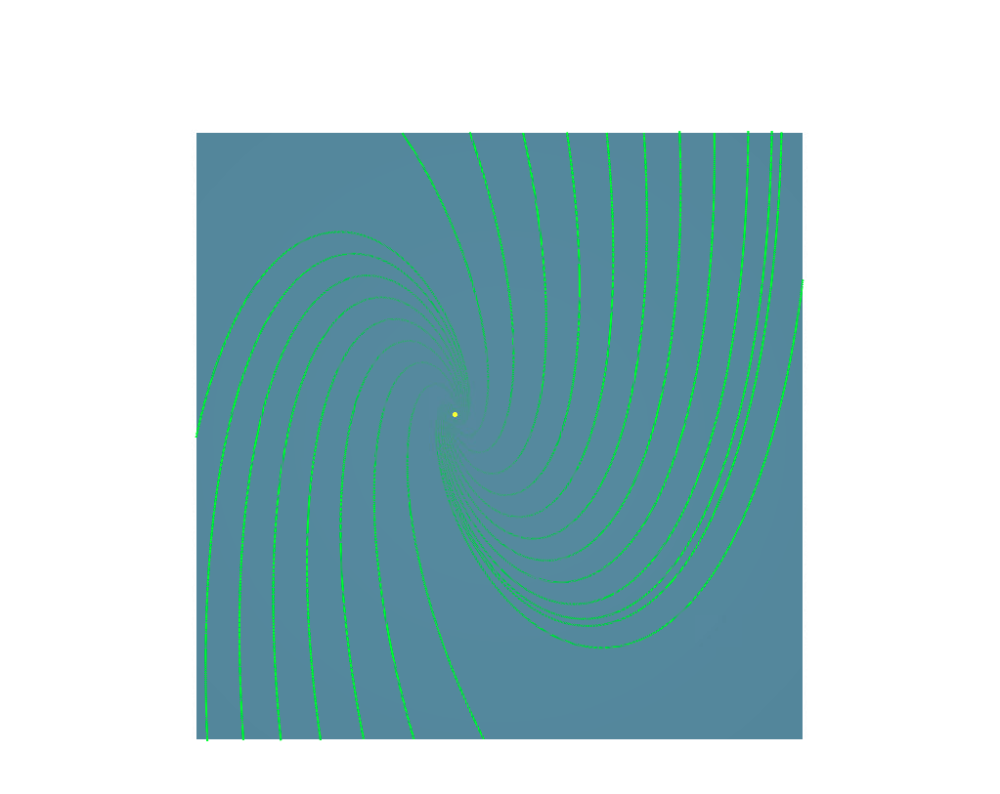
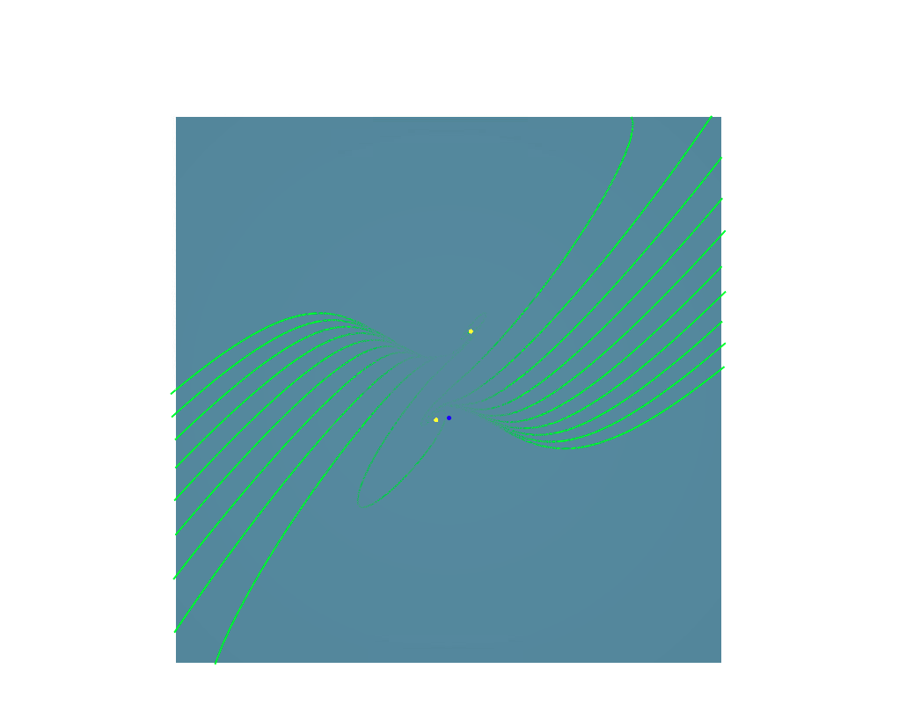

# Project 3
Scientific Visualizations  
Charles Ison  
11/13/2022

GitHub Link (for README markdown formatting): https://github.com/charles-ison/sv_project_3

### Running The Program
* Project was compiled and tested using VisualStudio on the machines in the Kelly computer lab  
* To change the photo that is used for each answer, update the file path in the learnply.cpp keyboard() (images are stored in the data/images/... folder)
* To run part 1.a.1 use the 'a' button (displays chosen image as input to the IBFV algorithm)
* To run part 1.a.2 use the 'b' button (displays chosen image as input to the IBFV algorithm and uses the vector field)
* To run part 1.c. use the 'c' button (extracts edges from the chosen image using the Sobel filter)
* To run part 1.d. use the 'd' button (extracts edges from the chosen image using the Sobel filter and uses the vector field)
* To run part 2.a. use the 'e' button (extracts all singularities from the vector field, the key to match the color and type is below)
* To run part 2.b. there are two ways to select a point, first either "ctrl" + "click" on a quad's vertex and a forward and backward streamline will be generated or "shift" + "click" on a quad and a forward and backward streamline will be generated from vertex V2
* To run part 3.a. use the 'f' button (extracts all singularities from the vector field on top of the IBFV vizualization of the same field)
* To run part 3.b. use the 'g' button (extracts all singularities from the vector field on top a streamline vizualization)
* To run part 3.c. use the 'h' button (extracts all singularities and separatrices from the vector field on top of a streamline visualization)

### Singularity Color Key
* Red is a source
* Blue is a sink
* Green is a saddle
* Light Blue is a center
* Yellow is a focus

### Question Answers

1.a.) When we use the image as the initial noise into the IBFV algorithm, the algorithm seems to smear to image in the directions the vector field is going. It creates a almost dreamy effect where the image starts to feel surreal. The impact can vary a lot depending on both the vector field and the image, but for the vector field visualized below (V10), I liked how it caused the image to almost spiral inward framing the mountains in each images.

* Avalanche Lake - Glacier National Park
* Bends the trees that frame the mountain image, almost feels like a Salvador Dali painting to me.

* Driving - Grand Teton National Park
* Makes it seem a bit like you are driving along the road towards the mountains at warp speed.

* Cracker Lake - Glacier National Park
* There are already patterns and lines in the rock face that blend in with the vector field. It is not immediately clear which parts of the rock face are natural or caused by the vector field.

1.b.) I personally like the V10 vector field the most for each of the three mountain lakes. First, I felt like the V10 vector fields creates a more dramatic change to the image than many of the other vector fields and I just enjoy the way while spiraling inward, it creates both a central focus area and a framing around the outside of the mountains.

1.c.)

* Avalanche Lake - Glacier National Park
* I really enjoy this visualization, I think the contrast between the trees, the lake, the waterfalls and the cliff become more noticeable than in the normal image.

* Driving - Grand Teton National Park
* In this one the road remains clear, but it becomes harder to tell what the mountains actually are. This could partically be do to the poor initial image quality after compressing.

* Cracker Lake - Glacier National Park
* In this one, the lake becomes very clear and looks calm, but the rock face is very busy.

1.d.)

* Avalanche Lake - Glacier National Park
* Compared to part 1.b., I think I enjoy the edge field visualizaiton more due to the contrast it makes between the main image photos: water, trees, and mountains. Once again, the V10 vector field was my favorite, but even more so on the edge field because it creates interesting framing with the bending trees versus the lake in the center.

* Driving - Grand Teton National Park
* Compared to part 1.b., I also like this image more. One reason for this is I feel the overall image quality is a bit low which becomes more noticeable in part 1.b., but here because we are focusing on the edges it seems more clear. Also the vector field V10 makes it seems like the mountains are spiraling inward while you are driving towards them, which is just a unique visual effect.

* Cracker Lake - Glacier National Park
* Compared to part 1.b., this might be the only one I liked less. Since the rock face is such a big part of the photo, it becomes harder to tell what is actually happening in 1.d. and I think the colors are unique and have a big impact in 1.b. That being said, the V10 vector field was once again my favorite, due to its dreamy and surreal impact on the photo.

2.a.)

* V1
* See "Singularity Color Key" above for classification

* V3
* See "Singularity Color Key" above for classification

* V4
* See "Singularity Color Key" above for classification

* V5
* See "Singularity Color Key" above for classification

* V6
* See "Singularity Color Key" above for classification

* V8
* See "Singularity Color Key" above for classification

* V9
* See "Singularity Color Key" above for classification

* V10
* See "Singularity Color Key" above for classification

2.b.)

* V1
* See "Running The Program" for directions on how to click and generate a single forward and backward streamline.

* V3
* See "Running The Program" for directions on how to click and generate a single forward and backward streamline.

* V4
* See "Running The Program" for directions on how to click and generate a single forward and backward streamline.

* V5
* See "Running The Program" for directions on how to click and generate a single forward and backward streamline.

* V6
* See "Running The Program" for directions on how to click and generate a single forward and backward streamline.

* V8
* See "Running The Program" for directions on how to click and generate a single forward and backward streamline.

* V9
* See "Running The Program" for directions on how to click and generate a single forward and backward streamline.

* V10
* See "Running The Program" for directions on how to click and generate a single forward and backward streamline.

3.a.)

* V1

* V3

* V4

* V5

* V6

* V8

* V9

* V10

3.b.)

* V1

* V3

* V4

* V5

* V6

* V8

* V9

* V10

3.c.)

* V1

* V3

* V4

* V5

* V6

* V8

* V9

* V10

